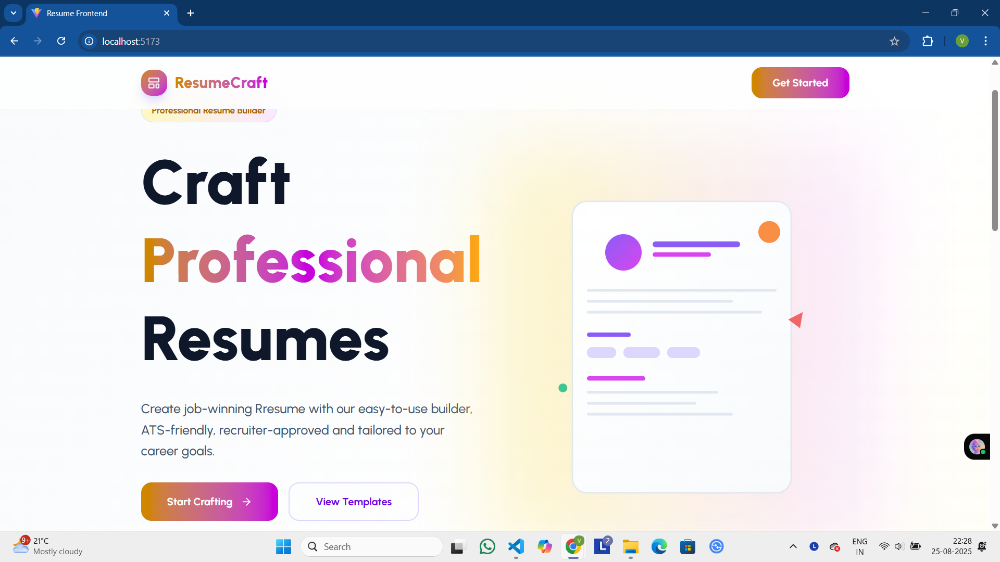
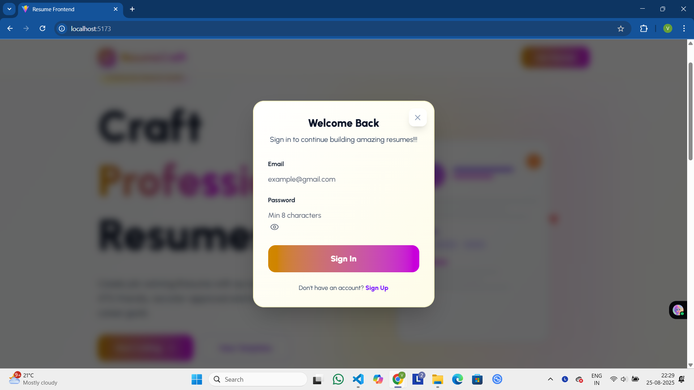
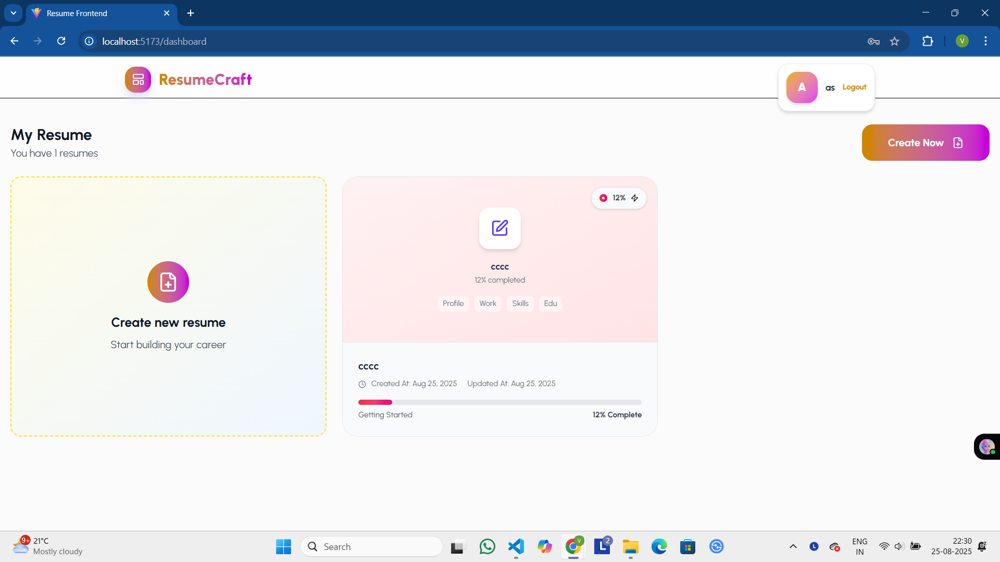
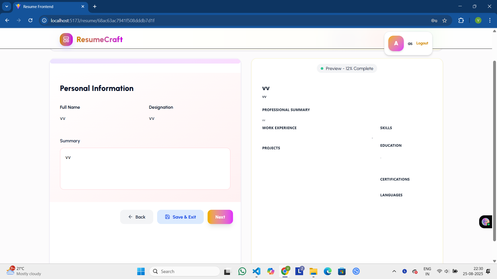

📄 ResumeCraft – MERN Resume Builder

A Resume Creating Web Application built with the MERN stack (MongoDB, Express.js, React.js, Node.js) that allows users to create, customize, and download professional resumes.

🚀 Features :

✍️ Create and edit resumes with dynamic input fields
🎨 Multiple templates & design customization
📂 Save resumes in database with user authentication
⬇️ Download resumes as PDF
🔐 Secure login & signup using JWT authentication
📱 Responsive design for desktop & mobile
☁️ Cloud deployment (MongoDB Atlas + Vercel/Render/Netlify)

🛠️ Tech Stack :

Frontend: React.js, TailwindCSS/Bootstrap (your choice)
Backend: Node.js, Express.js
Database: MongoDB (MongoDB Atlas)
Authentication: JWT + bcrypt.js
PDF Generation: html2canvas / jsPDF / Puppeteer (depending on your implementation)

📸 Screenshots
Landing Page

Login Page

Dashboard

Resume Editing Section
